- [Производная - это просто. Это скорость роста, это скорость роста!](#производная---это-просто-это-скорость-роста-это-скорость-роста)
  - [Саммари](#саммари)
- [Одна история охуительней другой, конечно, но что с этим делать?](#одна-история-охуительней-другой-конечно-но-что-с-этим-делать)
- [Примеры решений](#примеры-решений)
  - [1](#1)
  - [2](#2)
  - [3](#3)
  - [4](#4)
  - [5](#5)
  - [6](#6)
- [Self-practice!](#self-practice)
- [To be continued](#to-be-continued)

# Производная - это просто. Это скорость роста, это скорость роста!
[Просто по приколу](https://www.youtube.com/watch?v=7wFgvR-EEA0) (*А может быть и нет ;)*)

Ну а теперь серьёзно.

Сначала будет бесячее стандартное определение, потому что, как я надеюсь, после дальнейших объяснений оно станет приятным и понятным.

Возьмём некоторую функцию $y = f(x)$

Пусть $x_0$ - начальное значение функции, $x_1$ - новое значение ($x_1 > x_0$). $\Delta x = x_1 - x_0$ - приращение аргумента.

$y_0 = f(x_0)$. $y_1 = f(x_1) = f(x_0 + \Delta x)$. Тогда определим также $\Delta y = y_1 - y_0 = f(x_0 + \Delta x) - f(x_0)$ - приращение значения функции.

Теперь представим, что значения $x_0$ и $x_1$ очень-очень близки друг к другу. Тогда значение $\Delta x$ будет очень-очень близко к нулю. Значение выражения $\frac{\Delta y}{\Delta x}$ в таком случае и будет называться производной функции $f(x)$ в точке $x_0$ (*Либо $x_1$ - не забываем - они невероятно близки по значению*).

Как это будет выглядеть на практике:

Возьмём функцию $f(x) = x^2$

1. Весьма далёкие точки
   1. $x_0 = 0$
   2. $x_1 = 2$
   3. $y_0 = 0^2 = 0$
   4. $y_1 = 2^2 = 4$
   5. Изобразим на графике функцию $f(x)$ и прямую, проходящую через точки $(0; 0)$ и $(2; 4)$
   6. 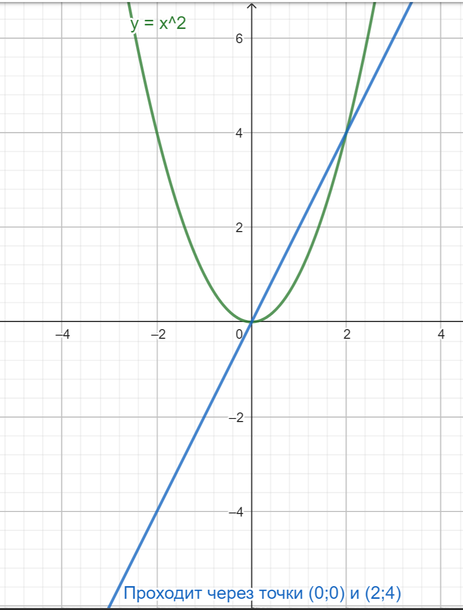
2. Передвинем точку $x_0$ чуть ближе
   1. $x_1, y_1$ остаются неизменными, как и одна из точек для прямой
   2. $x_0 = 1$
   3. $y_1 = 1^2 = 1$
   4. Проведём новую прямую на графике взамен старой
   5. 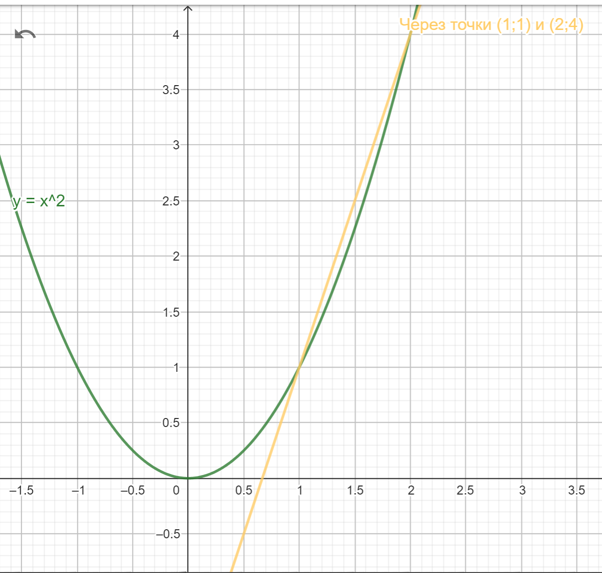
3. И, наконец, почти полное сближение:
   1. $x_1, y_1$ всё также неизменны
   2. $x_0 = 1.999999$
   3. $y_0 = 1.999999^2 = 3.999996000001$ (округлим до $3.999996$)
   4. Получаем следующую прямую
   5. 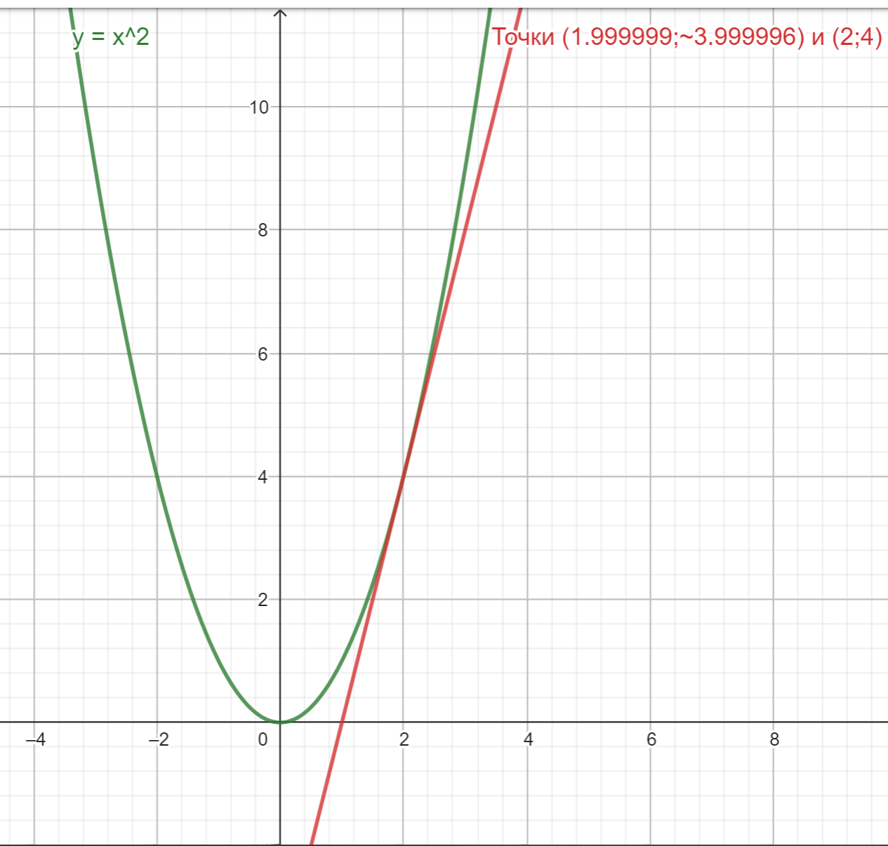
   6. В приближении
   7. 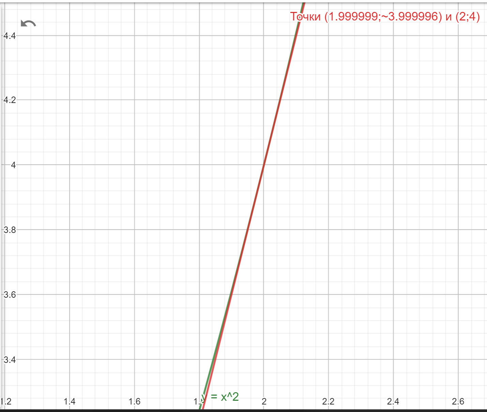

Уже здесь даже при большом увеличении создаётся ощущение, что точка всего одна, значит отсюда мы получаем касательную, то есть прямую (*Ваш кэп*). Уравнение прямой в общем виде записывается как $y = kx + b$. Изучая последний график, мы можем сказать, что для него $k = 4 = -b$. Также $k$ можно найти, вычислив тангенс наклона касательной относительно оси $Ox$ Главная же фишка заключается в том, что значение $k$ - это и будет значение нашей производной в точке касания.

И действительно, мы знаем, что $(x^2)' = 2x$, тогда как именно в точке с $x = 2$ мы получаем $k = 4$

Если взять сближение к абсолютно любой другой точке графика $y = x^2$, мы увидим, что всё те же правила будут справедливы.

Для того, чтобы убедиться в этом, будем таким же образом, как и раньше, сближаться теперь к $x = -2$, выстраивая касательную:

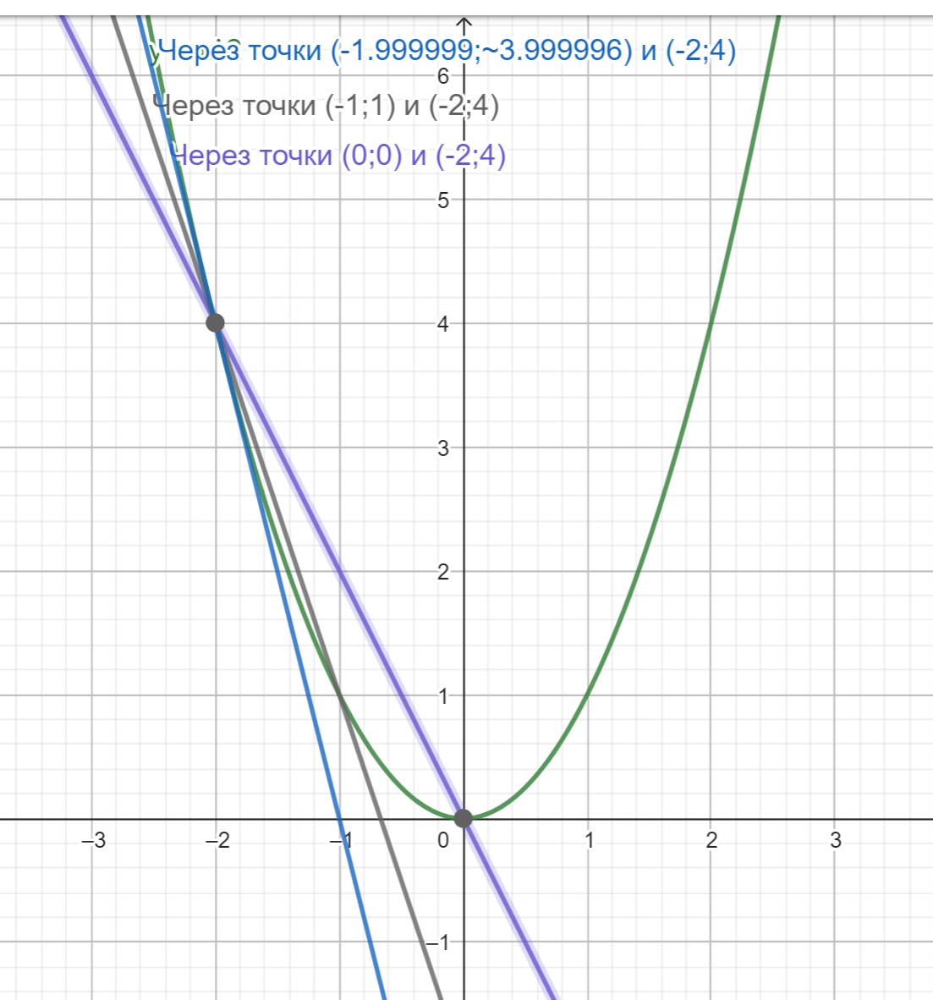

Посчитаем теперь $k$ для прямой касательной (синяя прямая), используя тангенс: $k = tg (Ox \land Blue) = \frac{4}{-1} = \frac{-4}{1} = -4$ (в первом варианте смотрели слева от графика прямой, во втором - справа). Если подставим значение $-2$ в производную, то получим то же $-4$

Уже без нескольких сближений изображу также касательные к графику $f(x) = x^2$ в точках $-4, -1, 0, 1, 4$:
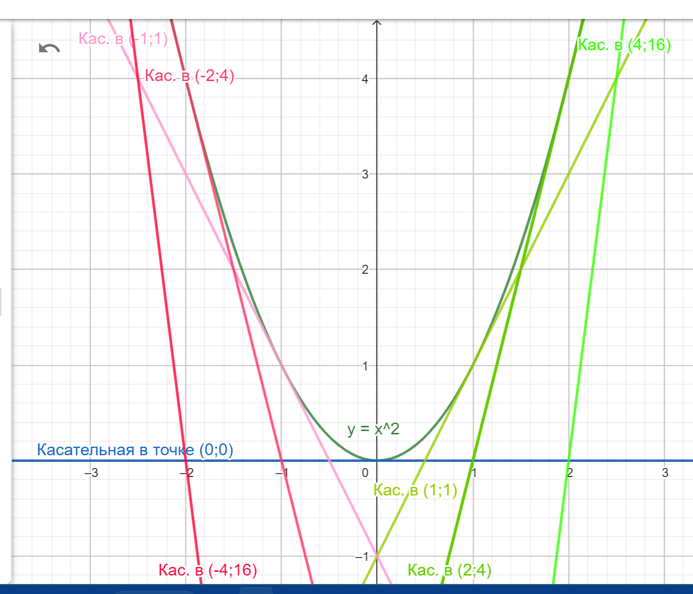
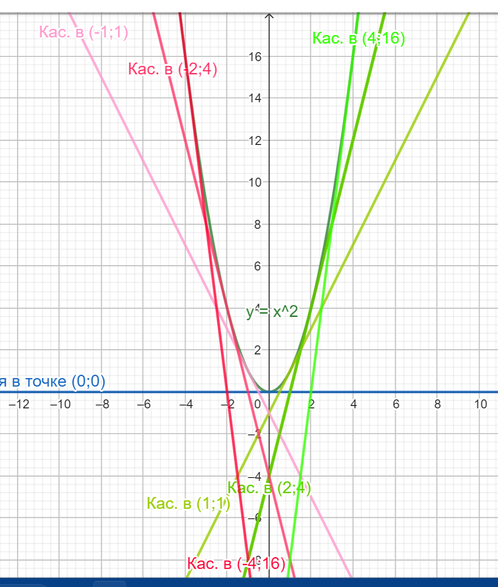

---

## Саммари
Здесь достаточно явно будет наблюдаться следующее свойство касательных к графику функции: чем больше множитель $k$ по модулю, тем более вертикальной будет задаваемая прямая. А если этой прямой будет касательная к графику функции, то более вертикальной она будет тогда, когда между сближаемыми точками происходит более сильное изменение значения функции. Отсюда мы получаем, чем быстрее убывает или растёт функция в некоторой точке, тем меньше или больше будет в этой точке $k$ для касательной, **а значит, тем меньше или больше будет значение производной.** Таким образом, перефразируя определение из начала этого лонгрида, производная для $f(x)$ - это такая $f'(x)$, что её значение в конкретной точке будет отражать, насколько сильно изменяется функция $f(x)$ при сдвиге от этой точки. **Если ещё упростить, то значения производной показывают скорость роста исходной функции, из которой мы взяли производную**.

И действительно, изобразим на том же графике $f'(x) = (x^2)' = 2x$, возьмём некоторые из касательных и сопоставим их со значениями производной с $x$ точки касания:

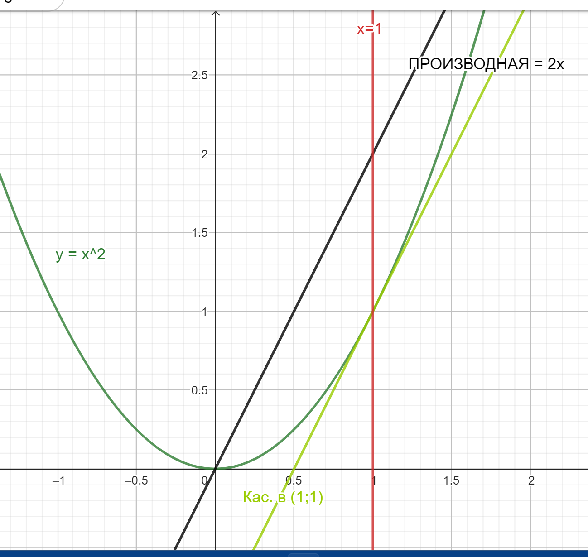
Значение производной в точке $x = 1$ будет $2$ - точно такое же, как $k$ касательной. Далее для демонстрации ещё несколько примеров, без отдельных пояснений: надеюсь, к этому моменту понятно, как считать $k$ и значение производной.

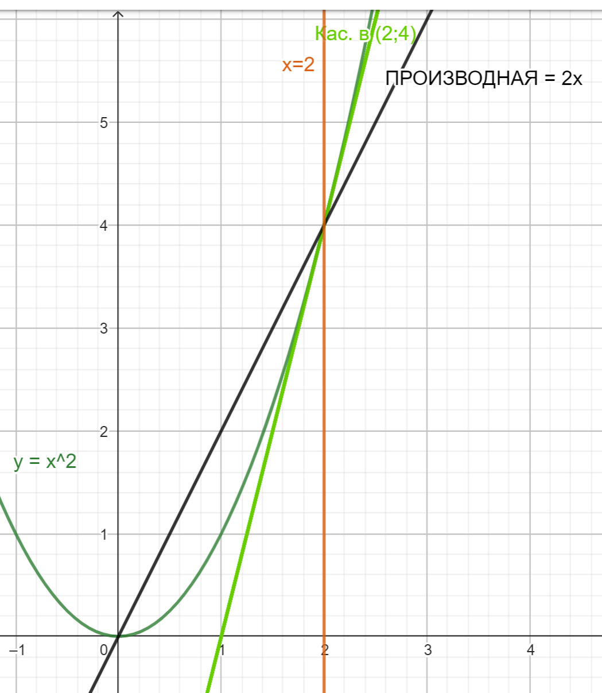
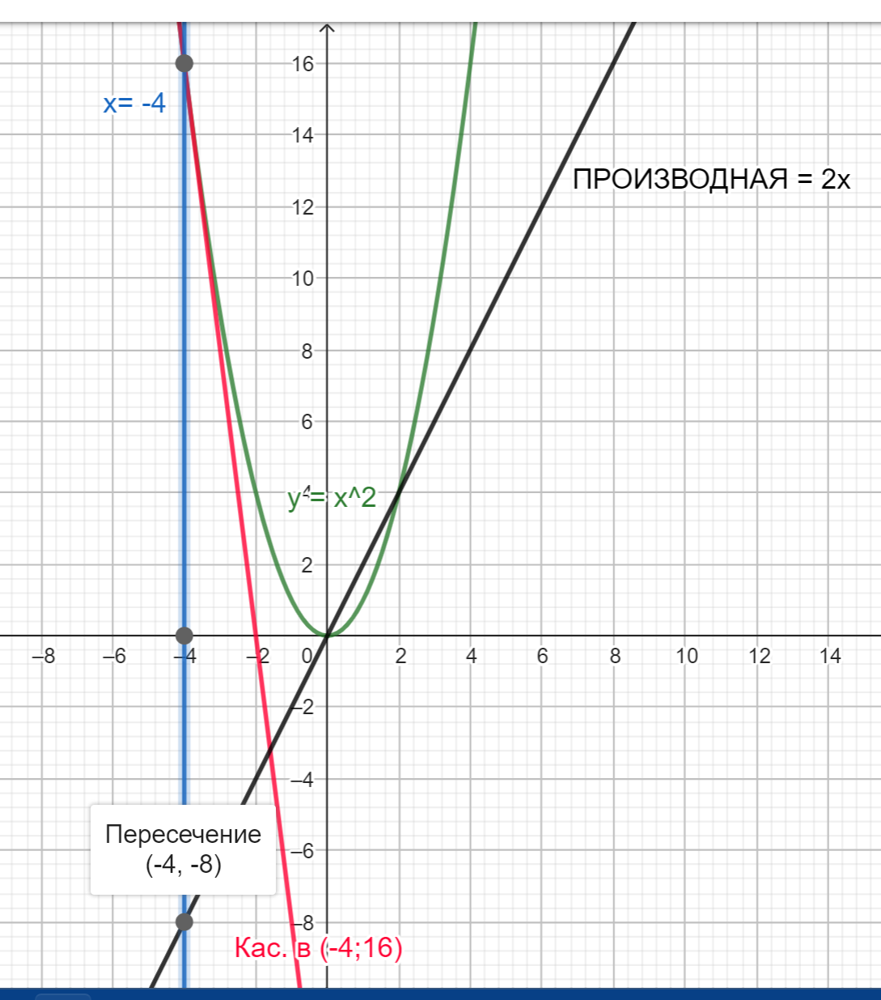

---

# Одна история охуительней другой, конечно, но что с этим делать?
Практический смысл заключается в конце [этого абзаца](#саммари). Если значение производной показывает нам скорость роста, то мы легко можем проанализировать 2 аспекта функции.

Первый - направление функции при движении вправо от выбранного икса. Если значение отрицательное, значит исходная функция убывает, если положительное - возрастает.

Второй - точки экстремума функции. Если производная в некоторой точке (*назовём её $x_0$ принимает значение $0$*), а по бокам от этой точки значения по знаку различны, то мы можем утверждать, что в этой точке находится экстремум. Если слева производная была отрицательной, а справа - положительной, значит слева от $x_0$ исходная функция убывала, а справа - начнёт возрастать. Из этого по логике следует, что в точке $x_0$ находится минимум исходной функции (или один из минимумов). Точно по такой же логике выводится и метод поиска максимумов: слева от пересечения с $Ox$ производная положительная, а справа - отрицательная.

Проверим это на нескольких примерах:
- $f(x) = \sin x$
  - $f'(x) = \cos x$
  - 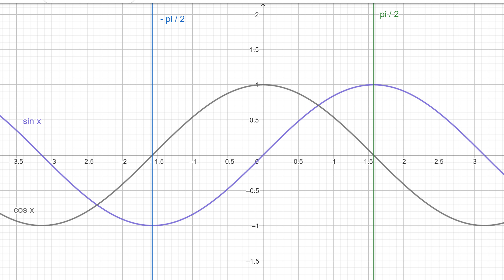
  - В точке $x = \pi / 2$ наша производная в виде косинуса принимает значение 0. Слева положительная, справа - отрицательная, значит при $x = \pi/2$ наша исходная функция синус даст максимальное значение. И действительно, $\sin(\pi/2) = 1$
  - В точке $x = -\pi / 2$ производная слева будет отрицательной, а справа - положительной. Значит при $x = -\pi/2$ мы получим минимальное значение, что и подтверждается проверкой: $\sin(-\pi/2) = -1$
- $f(x) = x^3$
  - $f'(x) = 3x^2$
  - 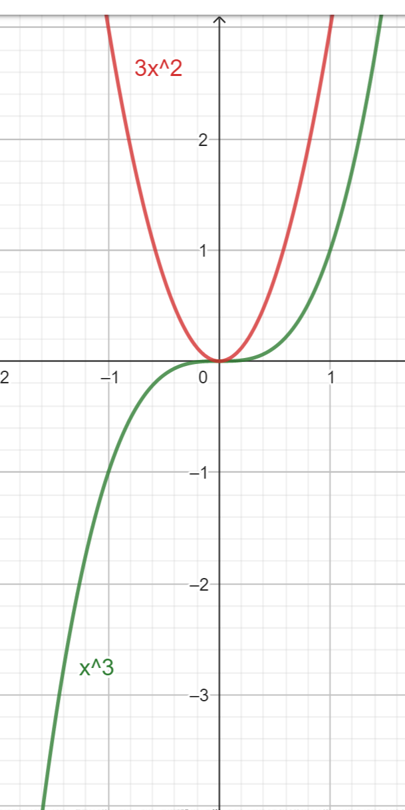
  - Хотя у производная при $x = 0$ и принимает значение $0$, слева и справа от этой точки значение производной положительные, так что мы можем сказать лишь о том, что в точке $(0,0)$ исходная функция растёт медленнее всех других точек, но минимума и максимума тут не будет
- Более сложные интересные примеры рассмотрим на конкретных заданиях

<blockquote>Отступление: данная выше характеристика производных также позволяет работать с практическими данным. Если мы знаем функцию, которая от времени говорит нам пройденный путь, то, взяв от неё производную, получим функцию, показывающую нам скорость перемещения. Вспоминаем, что ускорение - это *чуть неловко проговаривает* скорость изменения скорости и понимаем, что производной от функции скорости будет функция ускорения. Если наша функция показывает состояние бюджета, то производная будет показывать доход и т.п.</blockquote>

Благодаря этим свойствам выполняется большинством из ЕГЭшных заданий, некоторые из которых сейчас разберём.

# Примеры решений
## 1
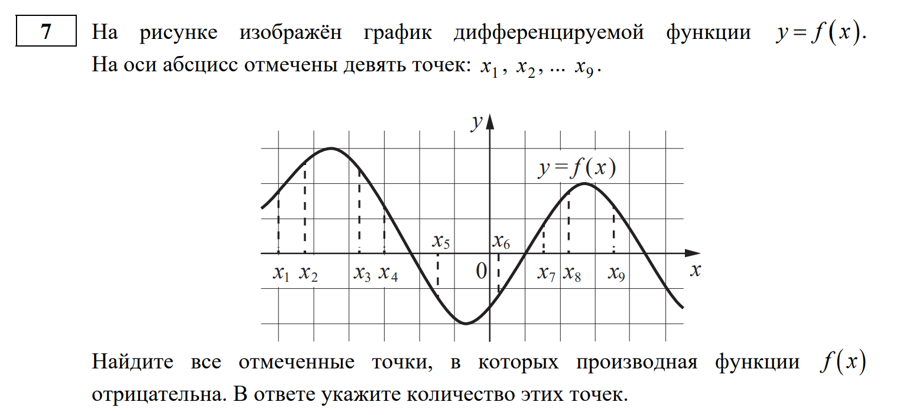

Производная будет отрицательна в точке $x_0$, когда $k$ касательной, проведённой через точку графика с абсциссой $x_0$ будет отрицательным, то есть касательная будет убывающей, то есть убывать будет и сама исходная функция. Таким образом, нам надо взять все точки, расположенные на убывающих участках графика. Ими будут $x_3, x_4, x_5, x_9$ - всего **4 точки**. Это число мы и запишем в ответ.

---

## 2
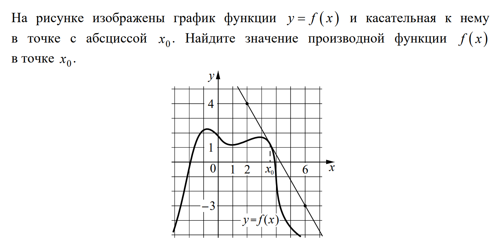

Снова вспоминаем о том, что значение производной в заданной точке - это $k$ касательной к графику функции в этой точке. $k$ в свою очередь можно вычислить 2 способами:
1. найти опорные точки (в которых касательная чётко проходит через целые значения в сетке координат) и решить систему уравнений с неизвестными $k, b$
   1. Возьмём точки `(2, 4)` и `(6, -3)`
   2. Получаем систему
      1. $2k + b = 4$
      2. $6k + b = -3$
   3. Вычитаем из первого второе и получаем $-4k = 7 \rArr k = 7/-4 = -1.75$
2. Вычислить тангенс угла наклона касательной, опираясь всё на те же опорные точки
   1. Углом наклона касательной считается острый угол между касательной и осью $Ox$ (*на скрине ниже это красный угол*), мы этот угол параллельно переносим до одной из наших опорных точек, если в этом есть необходимость (*перенесённый угол обозначен оранжевым*)
   2. Берём третью точку так, чтобы из неё и двух опорных получился прямоугольный треугольник
   3. Считаем длины его катетов
   4. 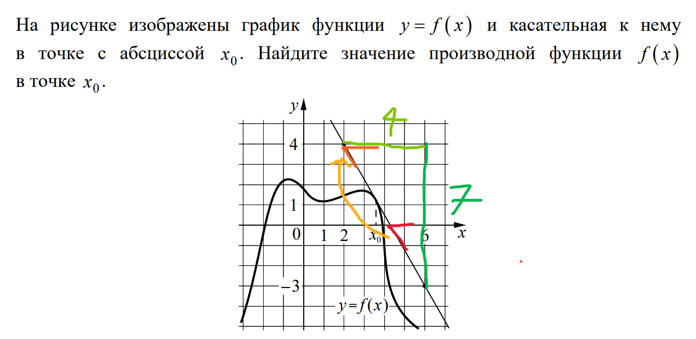
   5. И вычисляем тангенс по определению
   6. 7/4 = 1,75
   7. Далее надо учесть, что угол у нас располагается в IV четверти (*либо просто обратить внимание, что касательная у нас убывает, а значит и $k$ должен быть отрицательным*), тогда мы можем смело записывать ответ - $-1.75$

По описанию может возникнуть ощущение, что первый способ проще, но лично я почти всегда пользовался вторым. В общем, решать тебе. Очень важно тут помнить про знак, особенно во втором способе

---

## 3

Основная функция - $f(x) = x^2 + 7x + 3$

Какая-то прямая, параллельная касательной к графику этой функции - $p_1(x) = -3x + 2$

Что мы знаем о параметрах прямой? $b$ определяет сдвиг по игрикам, $k$ - наклон, значит интересующая нас касательная, параллельная к заданной прямой, будет иметь такой же $k = -3$, который, в то же время, является значением производной графика функции в точке касания. Значит нам нужно найти производную $f'(x) = 2x + 7$ и вычислить, при каком $x$ у неё будет значение $-3$:
- $2x + 7 = -3$
- $2x = -10$
- $x = -5$
- **PROFIT**

---

## 4
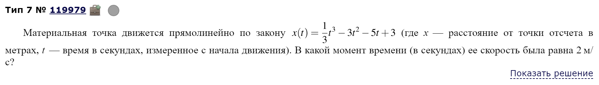

Вспоминаем о том, что производная функции пути - это скорость. Значит нам просто нужно найти производную этой функции, подставить значение $2$ и найти корни:
- $v(t) = x'(t) = t^2 - 6t - 5$
- $t^2 - 6t - 5 = 2$
- $t^2 - 6t - 7 = 0$
  - $t_1 + t_2 = 6$
  - $t_1 t_2 = -7$
- $\rArr$
  - $t_1 = -1$
  - $t_2 = 7$
- Время не может быть отрицательным, так что в качестве ответа записываем единственный оставшийся корень - $7$

---

## 5
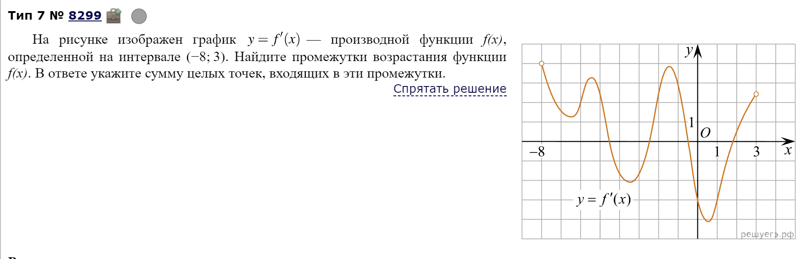

Исходная функция возрастает, когда производная, положительная, значит нас интересуют те целые $x$, при которых график производной будет выше оси $Ox$. Также учтём, что крайние точки интервала в сам интервал не входят. Суммируем точки и получаем: $-7 - 6 - 5 - 2 - 1 + 2 = -19$

---

## 6
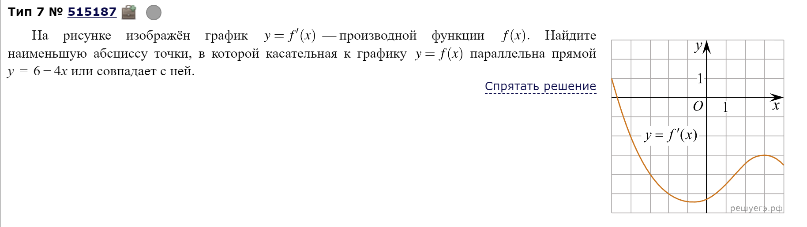

За похожей формулировкой скрывается уже похожий формат задач. Касательная к графику функции будет параллельна прямой $y = 6 - 4x$ или совпадать с ней в случае, когда $k$ касательной равен $k$ прямой, то есть равен $-4$, а значит минус четырём должно быть равно значение производной. На координатной плоскости проводим через значение $y = -4$ прямую, параллельную $Ox$ и видим, что такое значение принимает в двух точках. По условию нас интересует меньшее из значений абсциссы, а имы будет $-3$

---

# Self-practice!
В этот раз не буду делать скрины, а просто прикреплю ссылки на РешуЕГЭ. Так можно будет и сразу проверить решения, и если что найти похожие задания при необходимости:
- [https://ege.sdamgia.ru/problem?id=9063](https://ege.sdamgia.ru/problem?id=9063)
- [https://ege.sdamgia.ru/problem?id=510064](https://ege.sdamgia.ru/problem?id=510064)
- [https://ege.sdamgia.ru/problem?id=124215](https://ege.sdamgia.ru/problem?id=124215)
- [https://ege.sdamgia.ru/problem?id=8045](https://ege.sdamgia.ru/problem?id=8045)
- [https://ege.sdamgia.ru/problem?id=624108](https://ege.sdamgia.ru/problem?id=624108)

# To be continued
$\int$ `;)`
